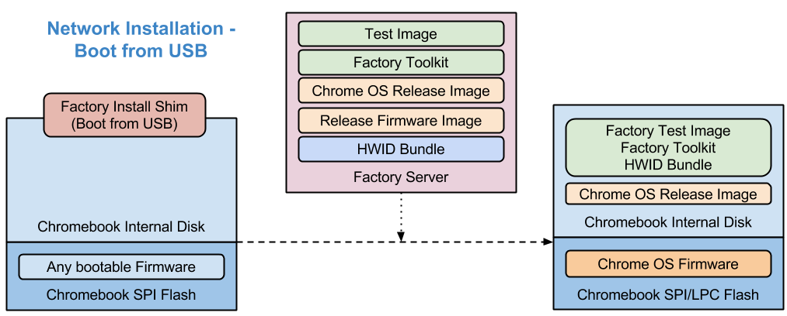
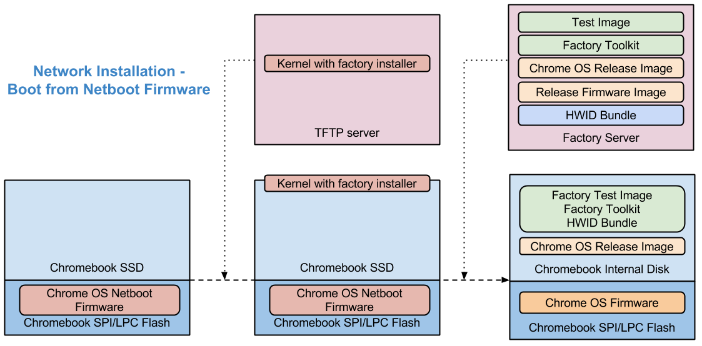
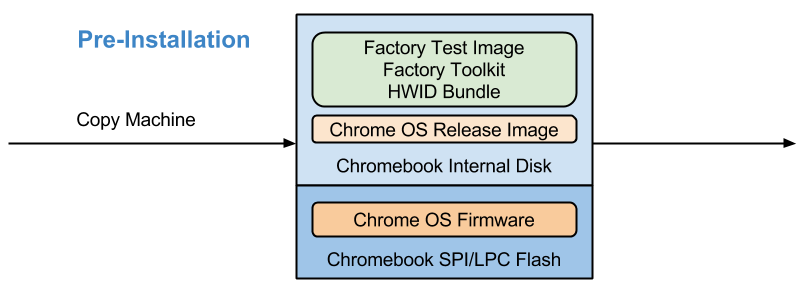
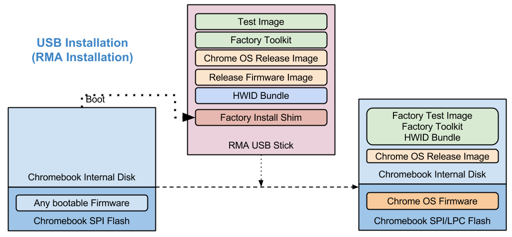

# Google Chromium OS Factory Software Platform

[TOC]

## Overview
This repository contains tools and utilities used for manufacturing solution.
The Chromium OS reference factory software provides various imaging methods,
test flow, and log collection pipeline for manufacturing Chrome devices. It is
available as part of the public Chromium OS repository on chromium.org. This
code is meant as a starting point, to modify and adapt to different projects.

The Chromium OS Factory Software Platform has three major components:

 * **DUT Software**

   Everything runs on DUT (Device Under Test), including a test harness "Goofy",
   qualification, calibration and functional test programs, and steps for
   finalization like battery cutoff or wiping.

 * **Factory Server**

   The bridge between DUT and partner's shopfloor backends, including imaging
   service, shopfloor proxy, and a management console.

 * **Google Backend**

   Solutions for integration with Google infrastructure, including extensible
   pipeline for sending manufacturing logs back to Google Cloud.

## Terminology
* **Test image**

  The Chromium OS test image (built by `build_image test`).

* **Release image**

  The (usually signed) release image that end user is using
  (built by `build_image base`).

* **Recovery image**

  The (usually signed) release image with recovery installer so it's in
  install-able form (built by `build_image base; mod_image_for_recovery` and can
  be downloaded directly from Chrome OS Buildbots or CPFE).

* **Factory server**

  A server providing imaging service and proxy to partner's shop floor backend.
  This is is currently provided as a Docker image built and installed by
  `cros_docker.sh`, with a set of components. Find more details in
  [Factory Server](setup/FACTORY_SERVER.md) document.

* **Factory shim image**

  A special multi-purpose image that provides:
    - Installation from USB. Also known as RMA (Return Materiel Authorization)
      shim.
    - Installation from factory server. Also known as Factory Install shim.
    - Reset or cutoff a device after OOBE (Out-of-box experience) or OQC (
      Outgoing Quality Control) test. Also known as Reset Shim in this case.

* **Factory toolkit**

  A self-extraction package that contains a set of python
  programs, YAML/JSON configuration, and shell scripts that will install itself
  into /usr/local/factory. This is also considered as the main "factory test
  program" (built by running `emerge-$BOARD factory` or
  `make BOARD=$BOARD toolkit` inside factory repository).

* **[Factory bundle](setup/BUNDLE.md)**

  An archive containing everything: a release (recovery) image, test image,
  factory shim image, factory toolkit, and few setup programs.

## Typical Factory Flow
The basic steps are:

1. An initial/bootable version of the firmware for
   [AP](http://www.chromium.org/chromium-os/2014-firmware-summit) (and
   [EC](https://chromium.googlesource.com/chromiumos/platform/ec/+/master/README.md))
   is pre-flashed onto the SPI-ROM (and Chromium EC chip) before system
   assembly.
2. After mainboard is ready, use one of the [imaging methods](#Imaging-methods)
   to get the factory toolkit, test image, signed release image, and
   AP/EC firmware are installed or updated. Included on disk are two full Chrome
   OS images: the test image and the shipping image.
3. The system automatically reboots using the test image and begins
   manufacturing tests. This test suite is based on [pytest](py/test/pytests).
   The software supports sequencing tests, configuration, firmware and
   configuration updates, reboots, and other events in a configurable sequence.
4. Functional, Run-In, and manual tests run as configured. Upon completion,
   results are displayed on the screen. Results are also available as an
   electronic pass/fail record with detailed logs for uploading to the shopfloor
   server.
5. The test image and test code are automatically erased, leaving the release
   image as bootable in the "finalization" step.
6. On failure, the system continues running subsequent tests and reports
   failures on completion. Alternatively you can configure it to halt on failure
   at specific break points. For details, see the Options class in
   src/platform/factory/py/test/factory.py and generic test lists under
   src/platform/factory/py/test/test_lists/* .
7. The factory test image and release image can be combined into an SSD image
   and imaged onto the internal drive before assembly. The first time the device
   boots, the sequence starts at step 4 above, using the factory test image.

## Building Factory Toolkit
Under chroot, after [setting up board][1], you have few different ways to build
toolkit.

### Build toolkit with dependency
If you have only finished `setup_board`, for the first time there are few
dependencies you need to build before able to work on toolkits.

1. If you will need to build test images later, do a `build_packages --board
   $BOARD` to get all dependency packages merged.

2. If you don't need to build full images (which may download huge files or
   build Chrome locally with very long time, another solution is to run
   following commands:
   ````
   cros_workon --board $BOARD start factory
   emerge-$BOARD factory-board factory --getbinpkg -j 16
   ````
   The `-j 16` means to merge in parallel, and should be changed to how many
   cores your machine has.

### Rebuild and get toolkit
Once you have get dependency ready, there are two different ways to help you
quickly get toolkit recompiled:

1. Using emerge. Simply run `emerge-$BOARD factory` and find it in
   `/build/$BOARD/usr/local/factory/bundle/toolkit/install_factory_toolkit.run`

2. Build manually. In factory repo, run `make BOARD=$BOARD toolkit` and find
   it in `build/install_factory_toolkit.run`.

If you encounter build problems, try to update chroot and rebuild necessary
dependencies by running `build_packages --board $BOARD` then try again.

The toolkit can be installed into a Chromium OS test image, by either running
that locally on a DUT, or apply to a test image directly as blow:

    ./install_factory_toolkit.run path/to/chromiumos_test_image.bin

## Building Test Image
Under chroot, after [setting up board][1], you can get the test image by running
following commands in `trunk/src/scripts`:

    build_packages --board $BOARD
    build_image --board $BOARD test

After image is built, you can flash it into an USB stick (assume your USB
appears as `sdX`):

    # inside chroot
    cros flash usb:// path/to/chromiumos_test_image.bin

    # outside chroot
    sudo dd bs=4M if=path/to/image/chromiumos_test_image.bin of=/dev/sdX \
            iflag=fullblock oflag=dsync

## Building Factory (Install) Shim
Under chroot, after [setting up board][1], you can get the factory shim by
running following commands in `trunk/src/scripts`:

    build_packages --board $BOARD
    build_image --board $BOARD factory_install

There are few options that you may want to change. The most important one is URL
to factory server. You have to set that as `CHROMEOS_AUSERVER` in
`dev_image/etc/lsb-factory` from first (stateful) partition. The utility
`setup/image_tool edit_lsb` can help that. For example, if
your server will run in `192.168.200.1` and using default port `8080`:

    setup/image_tool edit_lsb -i path/to/factory_install_shim.bin

And in the interactive menu you can select to change server host name (or IP)
and port.

After image is ready, you can flash it into an USB stick (assume your USB
appears as `sdX`):

    # inside chroot
    cros flash usb:// path/to/factory_install_shim.bin

    # outside chroot
    sudo dd bs=4M if=path/to/image/factory_install_shim.bin of=/dev/sdX \
            iflag=fullblock oflag=dsync

On boot, the factory shim displays a download status and downloads the image
from the server. On completion, the shim reboots. If you are using legacy
firmware (not Chrome OS firmware), you might need to remove the SD card to allow
booting the newly-installed image.

After the image starts downloading and the status message turns green, you can
remove the SD card—it is not needed after that point.

## Building Chromium OS Factory SDK Document
The API specification and details of each test are documented in the online
[Chromium OS Factory SDK](https://storage.googleapis.com/chromeos-factory-docs/sdk/index.html).

You can build with latest source locally:

1. Enter chroot.
2. Build the SDK documentation
````
    make doc
````
3. Open the following file in a browser window:
````
    build/doc/index.html
````

## Booting your (factory) test image via USB
For development and local testing, it is possible to boot the factory test image
from a USB memory stick rather than using a network installation. The following
steps sare optional:

1. Copy the test image to USB storage.
2. On your device, switch to developer mode. For most recent devices, this is
   done by pressing Esc-F3-Power (F3 is the refresh key on top row) then press
   Ctrl-D when the screen said that you need to insert a recovery USB stick,
   and press ENTER when the screen asked you to do.
3. After system reboot, enter VT2 by pressing Ctrl-Alt-F2 (F2 refers to the
   right-arrow key on top row).
3. Log in as root with password `test0000` if required.
4. Run the following command: `enable_dev_usb_boot`.
5. Insert the USB memory stick, reboot and press Ctrl-U at the dev mode warning
   screen. You can also enter VT2 and install the image to SSD using the
   `chromeos-install` command.

## Imaging methods
All of the methods will make sure the internal storage and firmware flash chip
are having right contents. A typical factory installation places the factory
test image in the first slot of Chrome OS image partitions
([#2 and #3](http://www.chromium.org/chromium-os/chromiumos-design-docs/disk-format#TOC-Drive-partitions)),
and the release image in the second slot (#4 and #5).

For all imaging methods listed below, you will need resource files (release
image, test image, factory toolkit, hwid, ...) locally.  Please check
[BUNDLE.md](setup/BUNDLE.md) for how to download each resource from CPFE.

*** note
**Note:** All imaging methods except pre-installation will try to update Main
(AP) and EC firmware on target machine using a `chromeos-firmwareupdate` updater
program. If not specified, this will be pulled from the release (recovery) image
(i.e., --release) you've provided.

If you need to use a special version that is different from the one combined in
release image, add a `--firmware PATH` option to `image_tool rma-create`
command, or manually upload the updater file in Dome web UI.

Also, if you only want the DEV signed firmware (also known as unsigned), grab
the `updater.sh` from the `ChromeOS-firmware-Rxx-yyyy.0.0-<BOARD>.tar.bz2` or
`firmware_from_source.tar.bz2` and assign its path to `--firmware
path/to/updater.sh`.

Otherwise (a "signed firmware" like PreMP signed or MP signed), you have to ask
firmware engineer to upload right image, update ebuild files, get a new image
built and signed, extract the firmware from it:

    ./setup/image_tool get_firmware -i path/to/OS_IMAGE.bin

Then you can find a `chromeos-firmwareupdate` file and use it for
`image_tool rma-create` as `--firmware path/to/chromeos-firmwareupdate`.

Also, if you are simply testing and no HWID bundle yet, change the `--hwid PATH`
to `--hwid none`.
***

We support different imaging methods and here are the details:

### Network Installation
The typical way is to install from Factory Server via network. To do that, you
have to first setup the server. Read [Factory Server](setup/FACTORY_SERVER.md)
guide for more details.

#### Import images
After server is setup, open the Dome web interface, follow the instruction to
create a board, upload individual files to it or import a prepared
[bundle](setup/BUNDLE.md).

#### Boot from USB


After factory server is setup, flash the Factory Install Shim to an USB stick
and boot with it, select Install when you see a menu and proceed.

#### Boot from Netboot Firmware


If the Netboot firmware `image.net.bin` is available, flash the that to main
(AP) SPI firmware and just boot. You will need to setup the network environment
(details to be provided in future) so it can download a special kernel and then
run same installer as [Boot from USB](#Boot-from-USB). For more details, please
refer to [Netboot Setup](./setup/NETBOOT.md).

### Pre-Installation (Copy Machine)


To speed up the process, many factories will try to pre-flash the internal
storage so no imaging process is needed. You can generate the disk image from [a
factory test image and a release (recovery) image](setup/BUNDLE.md) using setup
scripts.

To do that, use `image_tool preflash` command:

    ./setup/image_tool \
      preflash -o disk_image.bin \
      --test_image=path/to/chromiumos_test_image.bin \
      --toolkit=path/to/install_factory_toolkit.run \
      --release_image=path/to/chromiumos_image.bin \
      --hwid=path/to/hwid_bundle.sh

You can image directly to a device, or to a .bin file. Available options are:

 * `--sectors=XX` specifies the number of sectors in the bin file

### USB Installation (RMA shim)


It is possible to install everything from same USB that boots system without
network. This is helpful in proto builds if network is not ready, and if copy
machine is not available. Read [RMA shim](setup/RMA_SHIM.md) guide for more
details.

## Modifying factory test image or adding test cases
The factory test image runs the series of [pytests](py/pytests) located at
`src/platform/factory/py/test/pytests/` (installed in
`/usr/local/factory/py/test/pytests/` on the DUT). The sequence of pytest cases
are determined by `test_lists` files under
`/usr/local/factory/py/test/test_lists/`. Status is logged to
`/var/log/factory.log` and more details can be found under `/var/factory/*`.

After modifying the source code, you can run the following commands to push
files to the DUT. The host machine and DUT must be on the same subnet.

1. Enter chroot.
2. Update factory source code on DUT:
````
  ./bin/goofy_remote DUT_IP_ADDRESS
````

For more information on how to add test cases, read
[Chromium OS Factory SDK](https://storage.googleapis.com/chromeos-factory-docs/sdk/index.html).

## More Resources
Here are few resources you will want to dig into more details:

### Factory Server
To setup factory server, read [Factory Server doc](setup/FACTORY_SERVER.md).

### Internalization
The DUT Software (Goofy) and pytests can be localized. Read the
[Localization Guide](po/README.md) for more information.

### Shopfloor Backend Integration
To help manufacturing line to track DUT status, and to retrieve information from
shopfloor backends (for example serial number, vital product data, serial
number, ... etc), ODM factory has to implement a XMLRPC web service following
[Shopfloor Service API](py/shopfloor/README.md).

### Test Lists
Most projects will want to adjust the ordering and parameter of tests. This is
controlled by a "test list" that will be read by the test harness "Goofy".
See [Test Lists Document](py/test/test_lists/README.md) for more details.

### HWID
Chrome OS devices are required to have an unique "hardware identifier (HWID)"
when leaving factory. This is involved with component qualification,
probing and verification. In factory there is a file controlling how HWID is
generated. Read [HWID Database User Guide](py/hwid/README.md) for more details.

### DUT Software Boot Initialization
When running software on DUT for manufacturing, we may usually need to do
something different from standard test images - for example disabling
power-saving control, or starting some special services.

We have a set of scripting controlling this. See [Init System](init/README.md)
for more details.

## Developer Notes
The layout of `/usr/local/factory`, as installed on devices' stateful
partitions, is as follows.  Most of these files are installed from
this repository, and follow this repository's directory structure.

 - `bin/`: Symbolic links to executable scripts and Python modules.
 - `build/`: Folder to contain build output artifacts.
 - [`devtools/`](devtools/README.md): Tools and scripts for developers.
 - `doc/`: Document templates and resources.
 - `go/`: Programs written in Go language.
 - [`init/`](init/README.md): Initialization of factory environment for Chrome
    OS.
 - `misc/`: Miscellaneous resources used outside of Goofy
 - `proto/`: Proto-buf schema definition.
 - [`setup/`](setup/README.md): Scripts and programs for partner to setup the
    environment.
 - `sh/`: Shell scripts.
 - `py_pkg/`: Symbolic link to enable importing Python packages

 - [`py/`](py/README.md): Python source code in the cros.factory module and
    sub-modules.

 - `board/`: Board-specific files (optional and only provided by board overlays,
    not this repository.) in board overlay:
    - `board_setup_factory.sh`: A script to add board-specific arguments when
      starting the Goofy (the factory test harness).
    - Other files needed by board-specific tests.

 - [`po/`](po/README.md): i18n resources.

Within the build root (`/build/$BOARD`), `/usr/local/factory/bundle` is a
"pseudo-directory" for the factory bundle: it is masked with
`INSTALL_MASK` so it is not actually installed onto devices, but any
files in this directory will be included in factory bundles built by
Buildbot.

Within board overlays, the `chromeos-base/factory-board` package may overlay
files into this directory structure.

For instance, a board overlay may install:

 - A board-specific test into `/usr/local/factory/py/test/pytests`.

 - `/usr/local/factory/bundle/README` to include a README in the
   factory bundle.

 - Any arbitrary board-specific file (e.g., a proprietary tool
   licensed only for use on a particular board) into
   `/usr/local/factory/board`.

 - `/usr/local/factory/board/board_setup_{factory,x}.sh` to customize
   Goofy.

## Development Tips
For developers, there may few tips you'd want to learn:

### Run Goofy in Docker
If you need don't have a real DUT and still want to invoke Goofy (for example to
work on test list or UI), it is possible to run Goofy in Docker. To do this,
prepare a Chromium OS test image, and then:

    setup/image_tool docker -i PATH_TO/chromiumos_test_image.bin
    setup/cros_docker.sh goofy try

Then open http://localhost:4012 to access Goofy interface.

### Sync code changes to remote DUT
The most safe way would be to build a new toolkit, copy to remote DUT, and
re-install. But to minimize turn-around time in each iteration, here are few
possible approaches:

1. `scp` the files you've changed, if you know exactly what files are needed.
2. `rsync` if you have a bunch of files that have been changed.
3. `bin/goofy_remote HOST` to sync code and run. You can also specify
   more arguments to start particular test, restart UI, etc.

### Work with both public repo and private board repo
Read [devtools/aufs](devtools/aufs/README.md) for more details.

[1]: https://chromium.googlesource.com/chromiumos/docs/+/master/developer_guide.md#initialize-the-build-for-a-board
